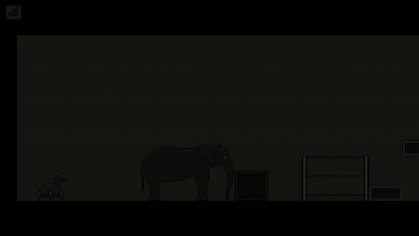

# MindControl
This is a puzzle platformer game that was created as a summer project in 2017. Since this was a programming project, it was coded in Java without using a game engine.

The main character of the game is a robot that has the ability to control animals. The objective of the game is to use the abilities of the controlled animals to solve puzzles and pass levels. Below is a gif illustrating the idea.

The project has been exported to MindControl.jar. The game is started by running this file. To do this you need Java installed.
